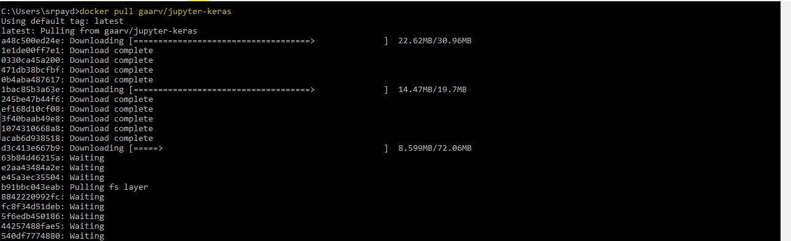
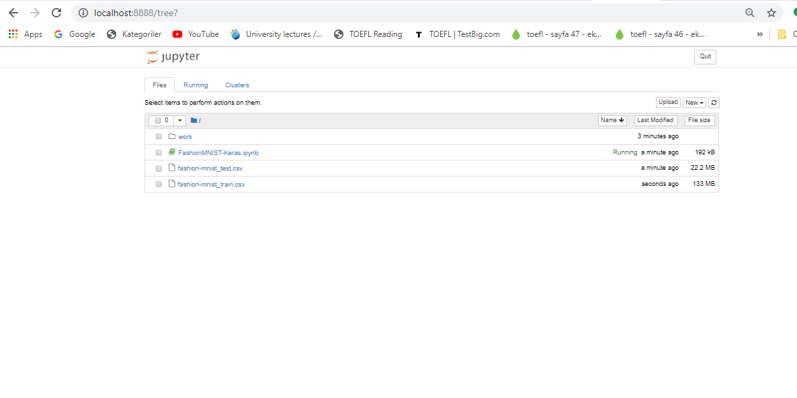
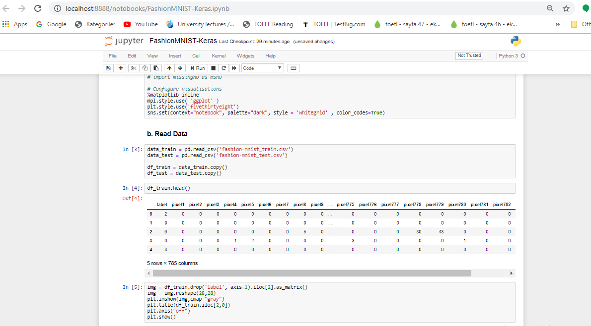

# 1. Fashion MNIST with Keras
The Fashion MNIST data contains 60.000 grayscale images in 10 categories in train dataset and 10.000
 grayscale images in test dataset. The images show individual articles of clothing at resolution 28X28 pixels.
 
 For this experiment, I used Keras which is a high-level API to build and train models and applied Convolutional Neural Network (CNN) which is one of the main categories to do images recognition, images classifications. Objects detections, recognition faces etc., are some of the areas where CNNs are widely used.

Technically, deep learning CNN models to train and test, each input image will pass it through a series of convolution layers with filters (Kernals), Pooling, fully connected layers (FC) and apply Softmax function to classify an object with probabilistic values between 0 and 1. The below figure is a complete flow of CNN to process an input image and classifies the objects based on values.

* <a href="https://ibb.co/kV1j9p"></a>

# 2. Dockerize a Keras Application on Jupyter Notebook

### Step-1 : Obtain the docker image
From DockerHub (https://hub.docker.com/r/floydhub/dl-docker/) Docker image is pulled. The image also could automatically built based on the Dockerfile in the Github repo.

```
docker pull floydhub/dl-docker:cpu
cd keras_datascience_container
```


```
docker build -t floydhub/dl-docker:cpu -f Dockerfile.cpu .
```


### Step-2 : Run the Docker image as a Container
Once the docker image is built, we are supposed to run a container that uses this image.

```
docker run -it -p 8888:8888 -p 6006:6006 floydhub/dl-docker:cpu jupyter notebook
```


After the above script, we should be able to access Jupyter Notebook (inside the container) from our localhost. The Jupyter notebook has Python (for Keras and Tensorflow) kernel.


### Step-3 : Implement the existing Jupyter code 
Once open the Jupyter notebook, we could upload our existing code and related datasets. We run it in the container and get the output data.

